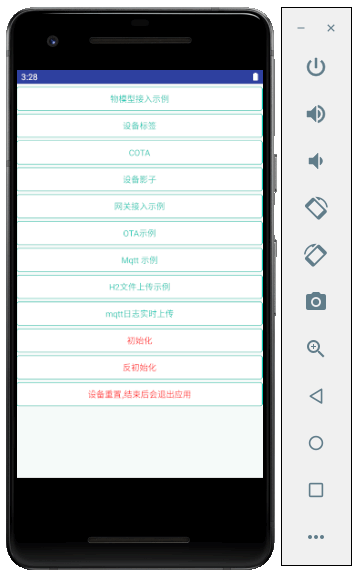
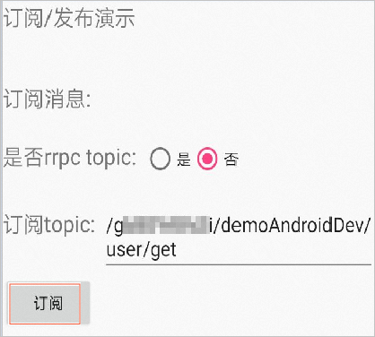
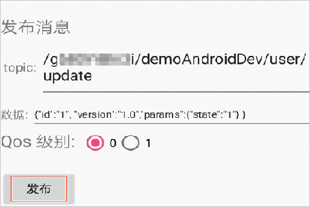

# 配置设备端SDK

关于 Android Link SDK 的更多信息，请参见 [Android Link SDK](https://help.aliyun.com/zh/iot/developer-reference/environment-requirements-and-configuration#concept-2050438)。

1. 打开已安装好的Android Studio，选择 **File > Open...**，找到下载的Demo文件并配置以下文件中的参数。

| 需配置的文件 | 参数 | 示例 | 说明 |
| :--- | :--- | :--- | :--- |
| `app/src/main/res/raw/deviceinfo` | productKey | a18wP****** | 设备认证信息。请将文件中的设备认证信息修改为您保存至本地的设备证书信息。 |
| | deviceName | LightSwitch | |
| | deviceSecret | uwMTmVAMnGGHaAkqmeDY6cHxxB****** | |
| | mqttHost | 实例地址:8883 | |

2. 下载解压 [ca.crt.zip](Docs/ca.crt.zip) 证书到 `app/src/main/res/raw/ca.crt`

并修改以下两处代码：

动态注册 `app/src/main/java/com/aliyun/alink/devicesdk/app/DemoApplication.java`

```java
//动态注册step2: 设置动态注册的注册接入点域名
MqttConfigure.mqttHost = mqttHost;
//新增下面代码
MqttConfigure.mqttRootCrtFile = getResources().openRawResource(R.raw.ca);
```

一机一密 `/app/src/main/java/com/aliyun/alink/devicesdk/manager/InitManager.java`

```java
//mqtt接入点信息. 详情请参照https://help.aliyun.com/document_detail/147356.htm
clientConfig.channelHost = mqttHost;
//新增下面代码
clientConfig.channelRootCrtFile = context.getResources().openRawResource(R.raw.ca);
```

3. 下载 [network_security_config.xml](Docs/network_security_config.xml) 到 `app/src/main/res/xml/network_security_config.xml`

并修改你的 AndroidManifest.xml

```xml
<application
  ...
  android:networkSecurityConfig="@xml/network_security_config"
  ...
>
</application>
```

4. 单击  按钮，完成项目的编译。

# 运行结果

+ 项目编译完成后，您可单击  按钮，运行项目。

如下图所示，Demo 程序在虚拟设备中成功运行，设备成功接入物联网平台。


单击 **Mqtt示例**。

1. 在 **Mqtt示例** 页面，将 **订阅topic** 修改为前面步骤中拷贝的订阅Topic内容，单击 **订阅**。

例如拷贝的内容为：`/a18wP******/${deviceName}/user/get`，您需要将产品名称和设备名称修改为您自己的。



Topic 订阅成功后，设备将接收到物联网平台发送的消息。在收到平台发送的消息之前，您可以自行给设备发送消息进行测试。

在 **设备详情** 页面的 **Topic列表** 页签，单击已订阅的Topic右侧的 **发布消息**，在 **发布消息** 对话框中输入一条消息，例如：`This is a test message from Alibaba Iot Platform`，模拟物联网平台向设备发送消息，您的设备将收到这条测试消息。

2. 在 **Mqtt示例** 页面，将 **发布消息topic** 修改为前面步骤中拷贝的发布Topic内容，并填入消息内容，单击 **发布**。

消息内容自定义，可以是中文等，下图仅为示例。


